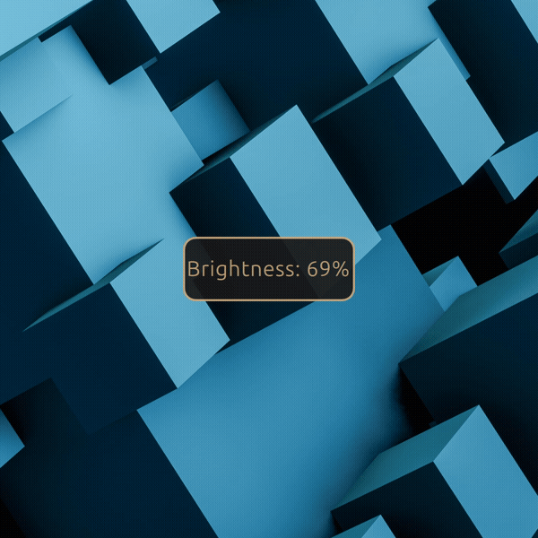

# Asus Dial Driver

A Linux driver and companion GUI for the Asus Dial hardware. Currently tested on Linux Mint (Ubuntu).

This is based on a fork of https://github.com/fredaime/openwheel/ with fixes to get the daemon
working, plus a new Qt6/QML tray + on-screen overlay (`asus-dial-gadget`) that turns the dial into
a Surface-Dial-style control for volume, screen brightness, scrolling, and media playback.

Special thanks to Frédéric AIME (https://github.com/fredaime) for making this project possible with the ground work he did with openwheel.


## DISCLAIMER
*Not affiliated with or endorsed by ASUSTeK Computer Inc. 
<br />
<br />
ASUS and ASUS Dial are trademarks of
their respective owner; they're referenced here only to describe the hardware this project is
compatible with.*

## Overview

There are 3 different versions of the asus-dial-driver.
The 3 different versions can be found in different branches of the repo,
v1-basic, v2-icons, v3-asus.

The main branch is currently the same as v3-asus as I think most people might prefer this UI.

## Demo

Below is a quick demo of what each UI looks like. Please note that ffmpeg did not capture my laptop screen going darker or brighter as I turned the knobs around in both directions, but I assure you they did!

The interaction is the same across versions — quick rotate adjusts whichever function is active;
press-hold-rotate-release opens the radial menu to pick a different one — only the menu's look has
changed:

**v3 — ASUS pie-ring**


**v2 — icons**


**v1 — text labels**



## What's here

- **`asus-dial-daemon`** — reads the Asus Dial's raw HID input and emits `Rotate`/`Press` events as
  D-Bus signals on the session bus (`org.asus.dial` / `/org/asus/dial`).
- **`asus-dial-gadget`** — a Qt6/QML tray icon and on-screen overlay that listens to those D-Bus
  signals and turns them into an actual usable dial: a radial menu (Surface-Dial-style) for picking
  which function the dial controls, live on-screen feedback, and a system tray with an
  enable/disable toggle and quit.

## Features

- **System tray icon** — reflects whether the daemon is currently connected (i.e. whether
  `org.asus.dial` is owned on the session bus); its menu has an Enabled toggle (pause the dial's
  effect without stopping the daemon) and Quit.
- **Radial menu** — press and hold the dial to open a menu of 4 functions, rotate while still
  holding to move the highlighted selection, release to confirm. While open, the overlay shows an
  "ASUS Dial" branded logo in the center; functions that aren't currently available (e.g. Media
  with no player running) are shown dimmed.
- **Four dial functions:**
  - **Volume** — adjusts system volume via `pactl` (PulseAudio/PipeWire).
  - **Brightness** — adjusts screen brightness via `systemd-logind`, always reading live hardware
    state (so it won't drift out of sync if brightness changes some other way while the gadget is
    running — e.g. a hotkey or another app).
  - **Scroll** — synthesizes scroll-wheel input into whichever window currently has focus (X11 via
    the XTest extension by default; Wayland via a `uinput` virtual device, needs one-time setup —
    see below).
  - **Media** — seeks ±5 seconds in whatever's currently playing, via MPRIS (works with most Linux
    media players).
- **On-screen feedback** — every rotate briefly shows a HUD with the function's name and current
  value (e.g. "Volume: 62%"), so a glance always tells you what the dial is controlling, even after
  not touching it for a while. Confirming a menu selection shows the same HUD with the
  newly-picked function's name (e.g. "Scroll").
- **Remembers your last pick** — the active function persists across restarts, defaulting to
  Volume on first run.

## How to use it

1. **Quick rotate** (dial not held down) — adjusts whichever function is currently active. A HUD
   pops up briefly (e.g. "Volume: 62%") and fades out after about 1.5 seconds.
2. **Press and hold** the dial — after about 400ms, a radial menu pops up in the middle of your
   screen showing all 4 functions (Volume / Scroll / Brightness / Media) arranged in a circle, with
   the "ASUS Dial" logo in the center.
3. **While still holding**, rotate to move the highlight between the 4 options.
4. **Release** the dial — this confirms whichever option is highlighted as the new active
   function, closes the menu, and briefly shows a HUD confirming what you picked. This is one
   continuous gesture (hold → rotate → release) — no second press needed.
5. **Tray icon** — open its context menu for the Enabled toggle and Quit. The icon itself changes
   if the daemon disconnects (e.g. if `asus-dial-daemon` isn't running).

## Building and launching

### Quick start (recommended)

From the repo root, after installing the dependencies below:
```bash
./launch-asus-dial.sh
```
This builds the daemon and gadget if they aren't already built, starts `asus-dial-daemon` if
nothing already owns `org.asus.dial` on the session bus (reusing an already-running daemon
otherwise), waits for it to register, then launches `asus-dial-gadget`. It only stops the daemon it
started itself when you quit the gadget — it won't touch a daemon started some other way.

Run it as your normal user — never with `sudo`. Nothing in this stack needs root once the udev
rule below is installed, and running any part of it as root breaks Volume/Brightness/Media: they
depend on your session D-Bus bus, PipeWire/PulseAudio, and systemd-logind session, none of which a
root process can reach (a root process also can't be authenticated on your session D-Bus bus at
all — it's rejected by D-Bus's own security policy, not just missing environment variables).

### Permissions (one-time setup)

The daemon needs read/write access to the dial's `hidraw` device, which is `root`-only by default.
Run the provided script to install the udev rule granting your user's `input` group access instead,
and to add you to that group if you aren't already a member:
```bash
./setup-permissions.sh
```
Run it as your normal user, not with sudo — it calls `sudo` itself only for the specific commands
that need it. If you'd rather run those commands by hand instead, they are:
```bash
sudo cp udev/99-asus-dial-hidraw.rules /etc/udev/rules.d/
sudo udevadm control --reload-rules
sudo udevadm trigger --subsystem-match=hidraw
sudo usermod -aG input $USER
```
Either way, unplug/replug the dial (or reboot) if `ls -la /dev/hidraw*` doesn't already show `group
input` on the dial's device, and log out and back in if you were just added to the `input` group
(most desktop setups already include this by default).

### Manual build

**Daemon:**
```bash
cd asus-dial-daemon
cmake .
make
```
Produces `asus-dial-daemon/asus-dial-daemon`. It needs read/write access to the dial's HID device, which
it finds automatically at startup by scanning `/sys/class/hidraw` for the ASUS2020 device (the
hidraw number shifts depending on what else is plugged in, e.g. docks/hubs) — see "Permissions"
above for one-time setup so this doesn't require root. Run it with `./asus-dial-daemon`.

**Gadget:**
```bash
cd asus-dial-gadget
mkdir -p build && cd build
cmake .. -DCMAKE_BUILD_TYPE=Release
cmake --build .
```
Produces `asus-dial-gadget/build/asus-dial-gadget`. Run it with `./asus-dial-gadget` — it needs the
daemon (or anything else emitting the same D-Bus signals) running to do anything. For testing
without physical hardware, you can inject signals directly:
```bash
dbus-send --session --type=signal /org/asus/dial org.asus.dial.Rotate int32:1
dbus-send --session --type=signal /org/asus/dial org.asus.dial.Press int32:1
```
(`Rotate` takes `int32` ±1 per detent; `Press` takes `int32` 1 on press / 0 on release — both on
`org.asus.dial` / `/org/asus/dial`, session bus.)

### Dependencies

Build (Debian/Ubuntu naming): `qt6-base-dev qt6-declarative-dev libqt6svg6-dev libxtst-dev`.

Runtime dependencies (also needed to actually run the built binary, not just compile it):
`qml6-module-qtquick qml6-module-qtquick-window qml6-module-qtqml-workerscript`, plus
`qml6-module-qtquick-shapes` on the icon-based v2 UI (see Demo above) for `RadialMenu.qml`'s icons.
Without these, the binary builds and links fine but exits immediately with "module ... is not
installed" QML errors as soon as it tries to load `DialOverlay.qml`.

### Autostart

To start both the daemon and gadget automatically when you log in (Linux Mint/Cinnamon or any
other XDG-autostart-compliant desktop), run once from the repo root:
```bash
./install-autostart.sh
```
This writes a per-user `~/.config/autostart/asus-dial.desktop` entry pointing at
`launch-asus-dial.sh` (no root/sudo — user-scoped only, same as everything else in this stack). It
takes effect on your next login. To remove it, delete that file.

### Wayland scroll support (optional)

The Scroll dial function uses X11's XTest extension by default and works out of the box on any X11
session. On Wayland, scroll instead uses a `uinput` virtual device, which requires one-time setup:
add your user to the `input` group so the gadget can open `/dev/uinput` without root — the same
`./setup-permissions.sh` from "Permissions" above does this; log out and back in afterwards if it
added you. If this isn't set up, the Scroll entry in the radial menu is simply disabled — every
other function works normally on Wayland regardless.

### Running tests

```bash
QT_QPA_PLATFORM=offscreen ctest --output-on-failure
```
(run from `asus-dial-gadget/build/`, no display server needed). If any test involving D-Bus fails,
or if you have `asus-dial-daemon` (or any other service already registered on `org.asus.dial`)
running while testing, wrap the command in `dbus-run-session --`, e.g. `dbus-run-session -- env
QT_QPA_PLATFORM=offscreen ctest --output-on-failure` — some tests take temporary ownership of that
D-Bus name, which conflicts with a real daemon (or any other owner) already holding it on your
regular session bus.

## Known limitations

- v1's radial menu and HUD are text-only; v2 replaces the labels with hand-drawn icons via
  `DialIcon.qml` (see Demo above).
- No per-app context — the active function is global, not tied to whichever app currently has
  focus.
- No rotation-speed sensitivity — the daemon reports rotation direction only, not how fast you're
  turning the dial.
- Only tested on Linux Mint (Ubuntu).
